#  Code Mastery

[](#languages)
[](#frameworks--libraries)
[](#frameworks--libraries)
[](https://code-mastery-6f4f19cafdb0.herokuapp.com/)
[](LICENSE)
[](#html-validation-w3c)
[](#css-validation-w3c-jigsaw)
[](#javascript-validation-jshint)
[](#python-validation-pep8)
[](#automated-testing)


### **Master code, one quiz at a time**

Code Mastery is an AI-powered quiz platform designed for developers, bootcamp students, and educators alike. Instantly generate quizzes on any programming topic using AI, create custom quizzes to share with your students or community, track your learning progress, and keep your coding knowledge fresh - whether you're learning, teaching, or preparing for interviews.

 **[Live Site](https://code-mastery-6f4f19cafdb0.herokuapp.com/)**

 **[GitHub Repository](https://github.com/tigerpadla/code_mastery)**

---

## Table of Contents

- [User Experience (UX)](#user-experience-ux)
  - [Project Goals](#project-goals)
  - [AI Implementation](#ai-implementation)
  - [User Stories](#user-stories)
  - [Agile Methodology](#agile-methodology)
- [Design](#design)
  - [Colour Scheme](#colour-scheme)
  - [Typography](#typography)
  - [Wireframes](#wireframes)
  - [Database Schema](#database-schema)
- [Features](#features)
  - [Existing Features](#existing-features)
  - [Future Features](#future-features)
- [Technologies Used](#technologies-used)
  - [Languages](#languages)
  - [Frameworks & Libraries](#frameworks--libraries)
  - [Tools & Services](#tools--services)
- [Testing](#testing)
  - [Automated Testing](#automated-testing)
  - [Manual Testing](#manual-testing)
  - [Validation](#validation)
  - [Bugs](#bugs)
- [Deployment](#deployment)
  - [Heroku Deployment](#heroku-deployment)
  - [Local Development](#local-development)
- [What I Learned](#what-i-learned)
- [Technical Decisions](#technical-decisions)
- [Credits](#credits)
- [Acknowledgements](#acknowledgements)

---

## User Experience (UX)

### Project Goals

#### The Problem

After speaking to countless developers and engineers, the advice I received was to tackle a problem that either I or people I know had experienced. After some deliberation, I identified an issue that I and my fellow students were going to encounter after finishing Code Institute's course: **keeping our programming knowledge fresh**.

When you're no longer in a structured learning environment with regular assignments and deadlines, it's easy for skills to fade. I wanted to create a tool that would help graduates and current students alike to continuously test and reinforce their knowledge.

#### The Solution

Code Mastery was born from this need - an AI-powered quiz platform that makes it easy to generate practice quizzes on any programming topic in seconds. But I didn't want to stop there. I decided to implement in this project everything I didn't have the opportunity to use during the Code Institute course:

- **API Integration** - Working with external services
- **AI Implementation** - Leveraging large language models
- **Real-time Features** - Notifications and dynamic content
- **Social Authentication** - OAuth with Google and GitHub
- **Cloud Media Storage** - Cloudinary integration

#### Beyond Students: Supporting Educators

The idea evolved beyond just helping aspiring programmers. After introducing my project idea to my bootcamp facilitator, he told me he'd be happy to use the platform in the cohort if it turned out well. This validation inspired me to add features specifically designed for **bootcamp facilitators and mentors**:

- **Quiz Sharing** - Mentors can create quizzes and share URLs directly with students
- **Featured Quizzes** - Admins can highlight recommended quizzes on the homepage
- **Notifications** - Creators receive feedback when students complete their quizzes
- **Public Quiz Library** - All quizzes are available for the community

The vision is to create a tool that supports the entire learning ecosystem - from self-taught developers to bootcamp students to the educators guiding them.

### Primary Goals

- **AI-Powered Learning**: Allow users to generate quizzes on any programming topic instantly using AI
- **Self-Assessment**: Enable students to test their knowledge and identify areas for improvement
- **Content Creation**: Allow users to create and share their own quizzes with the community
- **Progress Tracking**: Help users monitor their learning journey with quiz history and statistics
- **Accessibility**: Provide a responsive, accessible platform that works on all devices

---

### AI Implementation

#### Why AI?

Traditional quiz platforms require manual content creation, which is time-consuming and limits the range of topics available. By integrating AI, Code Mastery can generate relevant, educational quiz questions on virtually any programming topic in seconds - something that would take human authors hours to create.

#### Technology Choice: GitHub Models Marketplace

For the AI implementation, I chose to use the **GitHub Models Marketplace**, specifically the **GPT-4o-mini** model. Here's why:

| Consideration | Decision |
|---------------|----------|
| **Cost** | GPT-4o-mini offers excellent performance at a fraction of the cost of larger models |
| **Speed** | Fast response times (typically 2-5 seconds) for good user experience |
| **Quality** | Produces well-structured, accurate programming questions |
| **Integration** | GitHub Models provides a simple, well-documented API |
| **Reliability** | Backed by Microsoft/GitHub infrastructure |

#### How It Works

The AI quiz generation is handled by a dedicated `QuizGeneratorService` class in `quizzes/services.py`. The process involves:

1. **Topic Validation** - User input is validated against 140+ programming keywords to prevent misuse
2. **Prompt Engineering** - A carefully crafted system prompt ensures the AI generates programming-only content in the correct JSON format
3. **API Communication** - Secure HTTPS request to GitHub Models API with proper error handling
4. **Response Parsing** - JSON response is parsed and validated before creating database objects
5. **Error Handling** - Graceful fallbacks for API failures, timeouts, and invalid responses

#### Security Considerations

To prevent misuse (like the ["spaghetti and meatballs" incident](#spaghetti-and-meatballs-quiz-vulnerability) where users could generate non-programming quizzes), I implemented multiple layers of validation:

- **Keyword Allowlist** - Topics must contain recognized programming terms
- **System Prompt** - AI is instructed to only generate programming content
- **Guest Limits** - Non-authenticated users are limited to 1 quiz generation

### User Stories

User stories were created as GitHub Issues and managed on the project Kanban board, prioritized using MoSCoW methodology.

#### Must Have (MVP Core Functionality)
| # | User Story | Status |
|---|------------|--------|
| 1 | [AI Quiz Generation (Prompt Input)](https://github.com/tigerpadla/code_mastery/issues/1) - Generate quizzes by entering a programming topic | ✅ Done |
| 2 | [Guest Single Quiz Limit](https://github.com/tigerpadla/code_mastery/issues/2) - Allow guests to try one quiz before signing up | ✅ Done |
| 3 | [Random Quiz Generation](https://github.com/tigerpadla/code_mastery/issues/3) - Generate quiz on random programming topic | ✅ Done |
| 4 | [Interactive Quiz Attempt](https://github.com/tigerpadla/code_mastery/issues/4) - Take quizzes with multiple choice questions | ✅ Done |
| 5 | [Quiz Results Page](https://github.com/tigerpadla/code_mastery/issues/5) - View score and correct answers after completion | ✅ Done |
| 6 | [Manual Quiz Creation](https://github.com/tigerpadla/code_mastery/issues/6) - Create custom quizzes manually | ✅ Done |
| 7 | [Authentication](https://github.com/tigerpadla/code_mastery/issues/7) - User registration, login, and logout | ✅ Done |
| 8 | [User Profile](https://github.com/tigerpadla/code_mastery/issues/8) - View and edit profile with avatar and bio | ✅ Done |
| 9 | [Public Quiz Sharing](https://github.com/tigerpadla/code_mastery/issues/9) - Share quiz URLs with others | ✅ Done |
| 10 | [Database Storage for Quizzes and Attempts](https://github.com/tigerpadla/code_mastery/issues/10) - Persist all data in PostgreSQL | ✅ Done |
| 11 | [Admin Dashboard](https://github.com/tigerpadla/code_mastery/issues/11) - Manage content via Django admin | ✅ Done |
| 12 | [Premade Quizzes Section](https://github.com/tigerpadla/code_mastery/issues/12) - Display featured quizzes on homepage | ✅ Done |

#### Should Have (Enhanced UX)
| # | User Story | Status |
|---|------------|--------|
| 14 | [Social Profile Viewing](https://github.com/tigerpadla/code_mastery/issues/14) - View other users' public profiles | ✅ Done |
| 15 | [Attempt History](https://github.com/tigerpadla/code_mastery/issues/15) - View past quiz attempts and scores | ✅ Done |

#### Could Have (Nice to Have)
| # | User Story | Status |
|---|------------|--------|
| 16 | [Quiz Time Limit](https://github.com/tigerpadla/code_mastery/issues/16) - Add optional countdown timer | 📋 Todo |
| 17 | [Leaderboards](https://github.com/tigerpadla/code_mastery/issues/17) - Global and quiz-specific rankings | 📋 Todo |
| 18 | [Quiz Favorites](https://github.com/tigerpadla/code_mastery/issues/18) - Save quizzes to favorites list | ✅ Done |
| 19 | [Quiz Sharing](https://github.com/tigerpadla/code_mastery/issues/19) - Copy quiz link to clipboard | ✅ Done |

#### Won't Have (This Release)
| # | User Story | Status |
|---|------------|--------|
| 13 | [Saved Quiz Limits](https://github.com/tigerpadla/code_mastery/issues/13) - Limit number of saved quizzes | ❌ Won't Have |

### Agile Methodology

This project was developed using Agile methodology with GitHub Projects for task management. User stories were organized into a Kanban board with the following columns:

- **Backlog**: Features to be considered
- **Todo**: Prioritized for current sprint
- **In Progress**: Currently being developed
- **Done**: Completed and tested

🔗 **[Project Board - Code Mastery Mission Control](https://github.com/users/tigerpadla/projects/8)**

---

## Design

### Colour Scheme

The design uses a dark theme optimized for developers, with high contrast for readability during extended use:

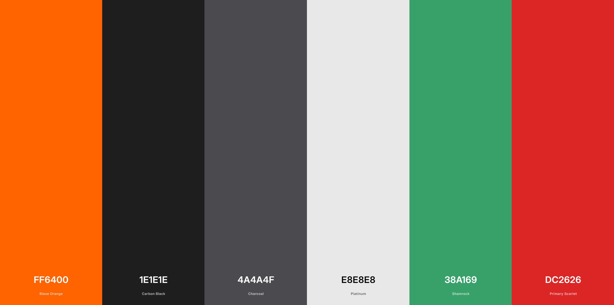

| Colour | Hex | Usage |
|--------|-----|-------|
| Blaze Orange | `#ff6400` | Primary accent, CTAs, highlights |
| Carbon Black | `#1e1e1e` | Main background |
| Charcoal | `#4a4a4f` | Secondary elements, cards |
| Platinum | `#e8e8e8` | Primary text |
| Shamrock | `#38a169` | Success states, correct answers |
| Scarlet | `#dc2626` | Error states, incorrect answers |

The orange accent was chosen to evoke energy and creativity while maintaining excellent contrast against the dark background.

### Typography

- **Raleway**: Used for headings - modern, clean sans-serif with excellent readability
- **Roboto**: Used for body text - highly legible at all sizes
- **Fira Code**: Used for code snippets - monospace font optimized for code display

All fonts are served via Google Fonts for optimal performance.

### Wireframes

Wireframes were created using Visily to plan the layout and user flow before development.

<details>
<summary>🏠 Home Page</summary>

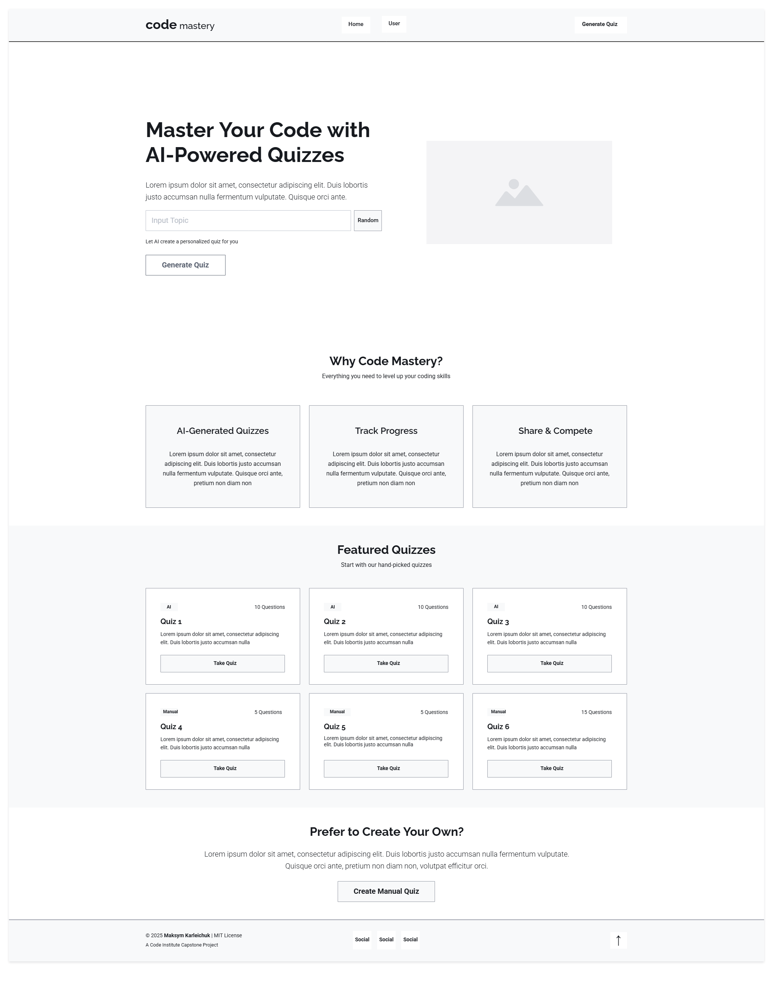

</details>

<details>
<summary>📝 Quiz Detail Page</summary>

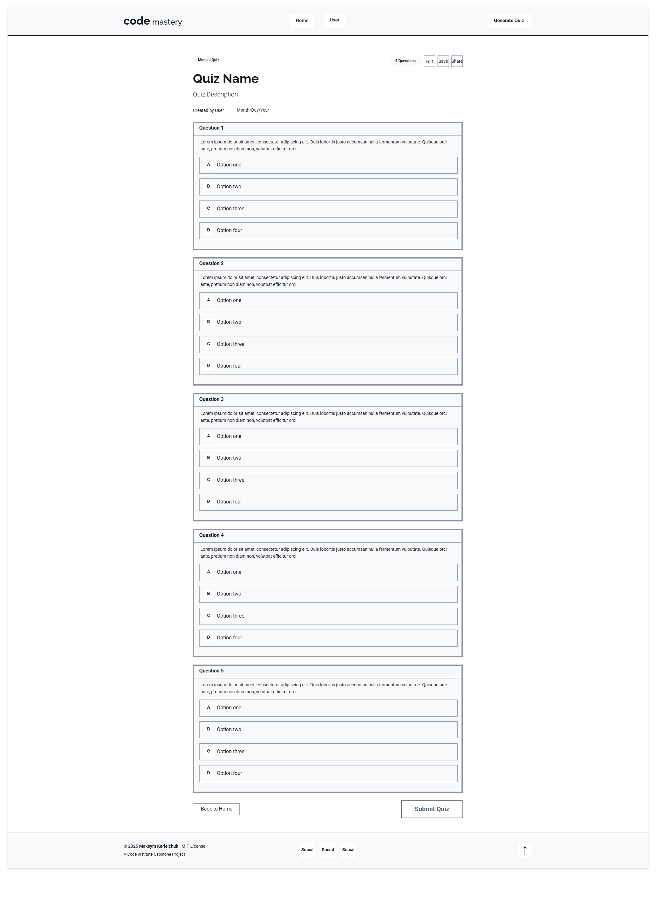

</details>

<details>
<summary>📊 Quiz Results Page</summary>

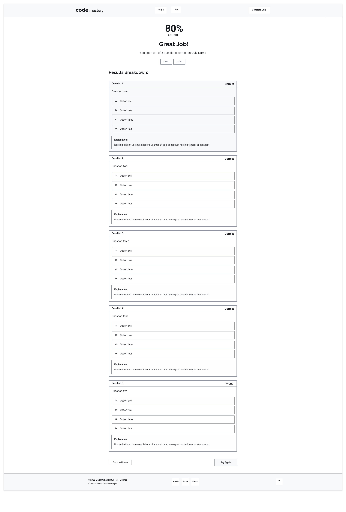

</details>

<details>
<summary>✏️ Create Quiz Page</summary>

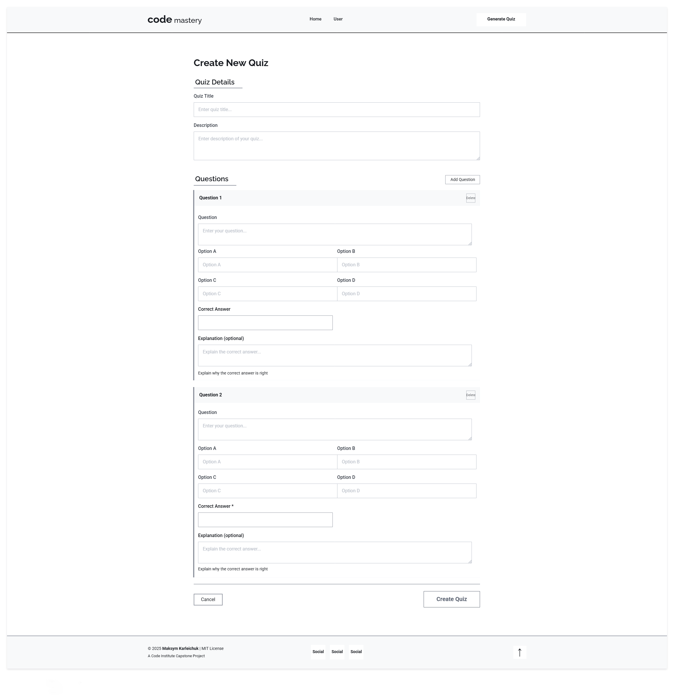

</details>

<details>
<summary>👤 Profile Page</summary>

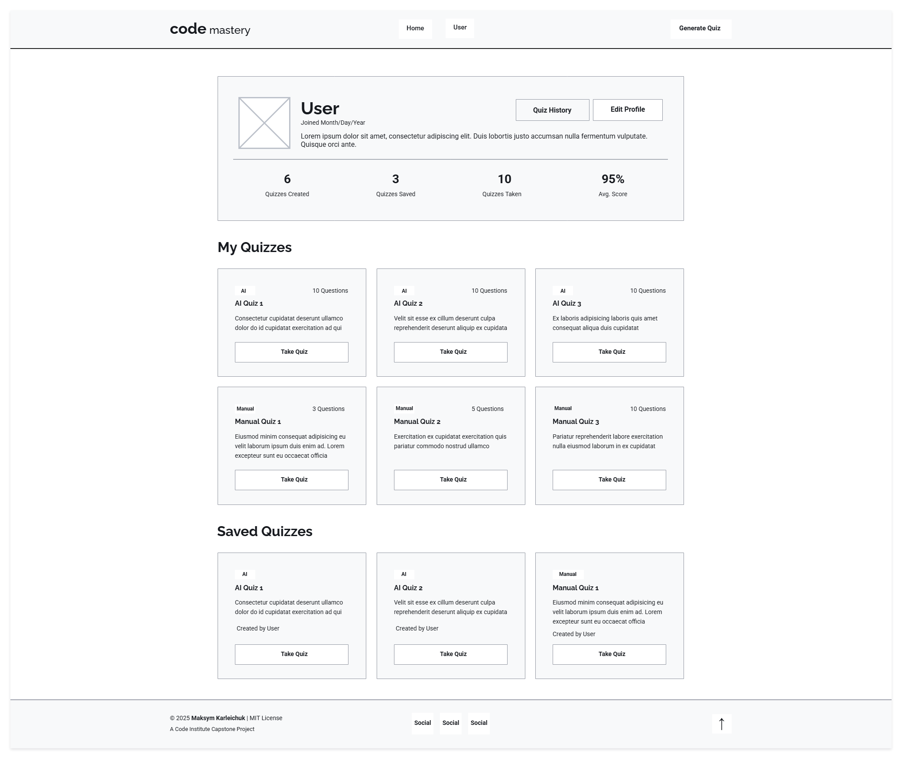

</details>

<details>
<summary>📱 Mobile Views</summary>

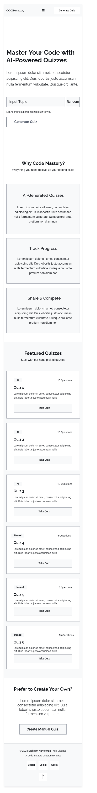
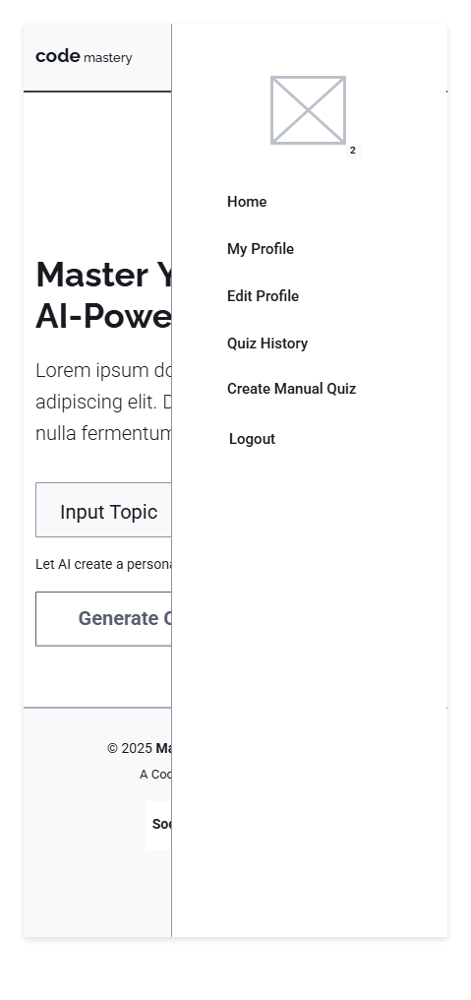
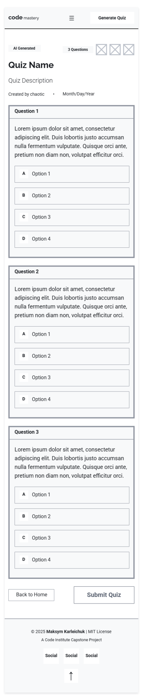

</details>

<details>
<summary>🔐 Authentication Pages</summary>

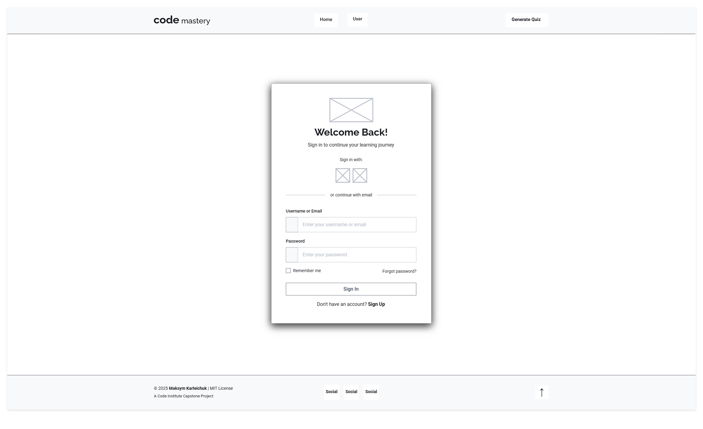

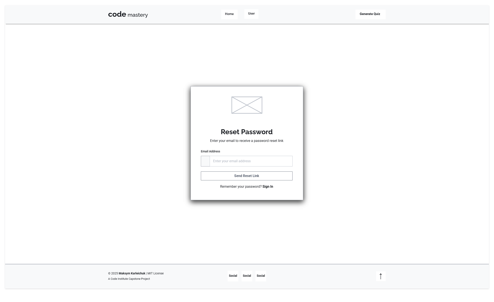

</details>

<details>
<summary>📋 Other Pages</summary>

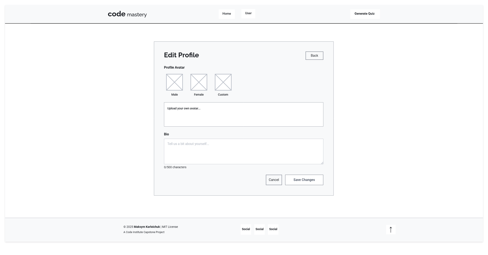

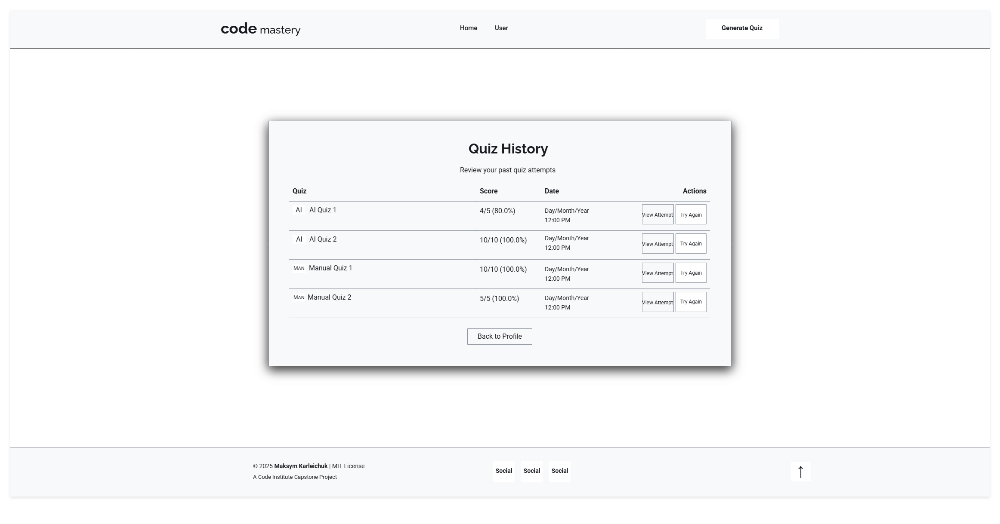
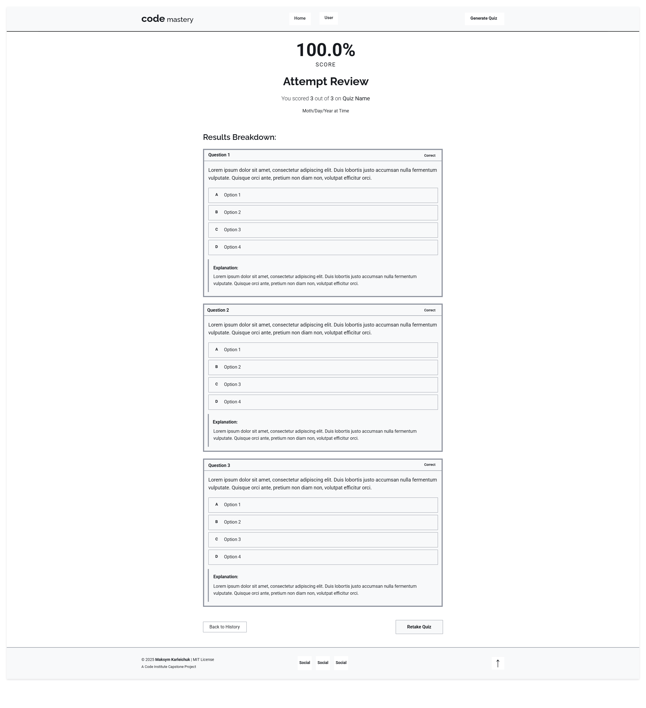
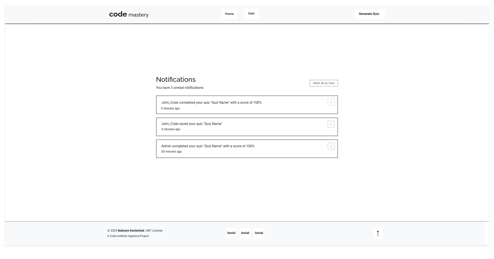

</details>

### Database Schema

The database uses PostgreSQL (via Neon) and follows a relational model with the following entities:


#### Models Overview

| Model | Description |
|-------|-------------|
| **User** | Django's built-in User model for authentication |
| **Profile** | Extended user profile with avatar, bio, and saved quizzes |
| **Quiz** | Quiz metadata including title, description, creator, and flags |
| **Question** | Multiple-choice questions with 4 options and explanation |
| **QuizAttempt** | Records of user quiz attempts with scores and answers |
| **Notification** | User notifications for quiz interactions |

#### Key Relationships
- **User ↔ Profile**: One-to-One (auto-created via signal)
- **User → Quiz**: One-to-Many (creator)
- **Quiz → Question**: One-to-Many (quiz questions)
- **User → QuizAttempt**: One-to-Many (attempt history)
- **Profile ↔ Quiz**: Many-to-Many (saved quizzes)

---

## Features

### Existing Features

#### 🏠 Homepage & Navigation

**Responsive Header**
- Fixed navigation bar with logo and menu items
- Mobile hamburger menu with smooth animations
- Notification bell with unread count badge
- User dropdown menu (desktop) / flat menu (mobile)

**Hero Section**
- Clear value proposition and call-to-action
- AI quiz generator input field
- Random topic dice button with 75+ curated programming topics
- Animated dice roll effect when generating random topics

**Featured Quizzes**
- Display of 6 featured/recent quizzes on homepage
- Quiz cards showing title, question count, and creator
- Quick access to start any quiz

<details>
<summary>View Homepage Screenshot</summary>

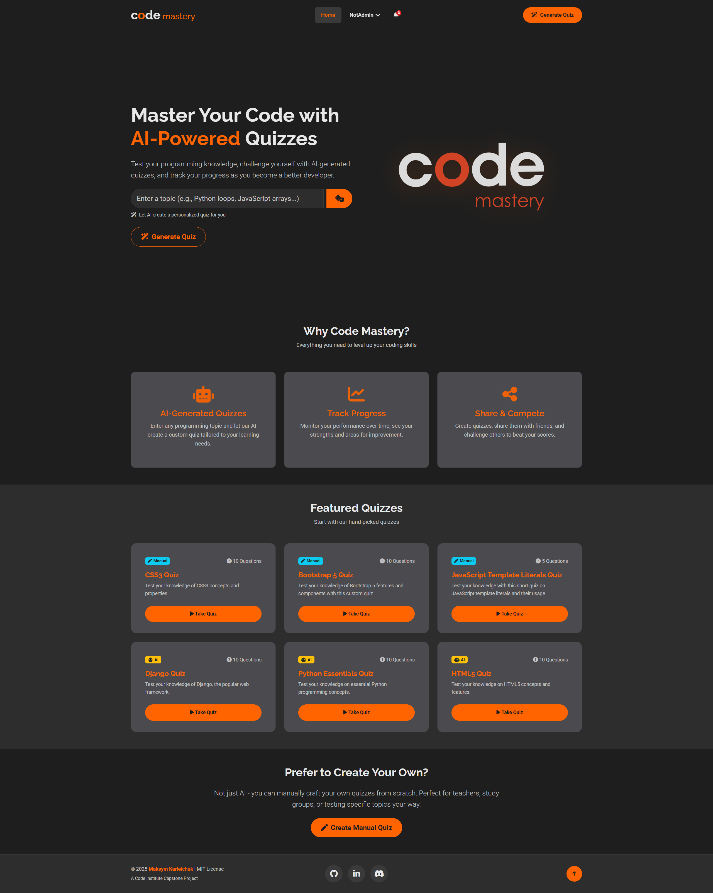

</details>

#### 🤖 AI Quiz Generation

**Topic-Based Generation**
- Enter any programming topic to generate a 10-question quiz
- AI creates relevant multiple-choice questions using GitHub Models API (GPT-4o-mini)
- Questions include explanations for learning
- Code snippets properly formatted in questions and answers

<details>
<summary>📊 AI Generation Process Flow</summary>

The AI quiz generation follows a multi-step process to ensure quality and security:

| Step | Process | Details |
|:----:|---------|---------|
| **1** | **User Input** | User enters a topic (e.g., "Python decorators") |
| ⬇️ | | |
| **2** | **Topic Validation** | Check topic against 140+ programming keywords (python, javascript, django, sql, git, react, etc.). Prevents non-programming topics like "spaghetti recipes". Returns error if invalid. |
| ⬇️ | | |
| **3** | **Prompt Engineering** | Build structured prompt with topic, difficulty, and question count. System prompt enforces programming-only content. Request JSON-only response format with exact structure. |
| ⬇️ | | |
| **4** | **API Request** | Send request to GitHub Models API (GPT-4o-mini). Include authorization token. Set temperature (0.7) for creative but consistent output. Handle timeouts gracefully. |
| ⬇️ | | |
| **5** | **Response Parsing** | Parse JSON response from AI. Clean any markdown formatting. Extract title, description, and questions array. Validate each question has 4 options + correct answer. |
| ⬇️ | | |
| **6** | **Database Storage** | Create Quiz object with title and description. Create Question objects for each question. Associate with creator (user or "AI Generated" for guests). Generate unique slug for URL. |
| ⬇️ | | |
| **7** | **Redirect to Quiz** | User is redirected to the new quiz detail page. Quiz is ready to be taken immediately. Creator can edit or delete the quiz. |

**🔒 Security Measures:**
- Topic validation prevents prompt injection attacks
- System prompt reinforces programming-only content
- Double validation (frontend keyword check + AI system prompt)
- Error handling for API failures with user-friendly messages

</details>

**Random Topic Feature**
- Dice button to get a random topic from 75+ curated options
- Topics cover Python, JavaScript, Django, SQL, Git, and more
- Animated dice roll effect for engaging UX

**Guest Limitation (1 Free Quiz)**

To balance accessibility with API cost management, guests (non-authenticated users) can generate **one free AI quiz** to experience the platform before signing up.

| Aspect | Implementation |
|--------|----------------|
| **Why Limit?** | AI API calls have associated costs. Unlimited guest access could lead to abuse and unexpected expenses. |
| **User Experience** | Guests get a genuine taste of the AI generation feature without commitment |
| **Conversion Strategy** | After the free quiz, a modal prompts signup with clear value proposition |
| **Technical Implementation** | Quiz count tracked via Django sessions (`request.session`), persisting across page navigations |
| **Unlimited Access** | Registered users enjoy unlimited AI quiz generation |

This approach ensures the platform remains sustainable while still allowing potential users to experience the core feature before creating an account.

#### ✏️ Manual Quiz Creation (CRUD)

**Create Quiz**
- Form to create custom quizzes with title and description
- Dynamic question formset - add/remove questions
- Each question has 4 options (A, B, C, D) with correct answer selection
- Optional explanation field for educational content

**Edit Quiz**
- Full editing of quiz details and questions
- Add new questions or remove existing ones
- Only quiz creator can edit their quizzes

**Delete Quiz**
- Confirmation modal before deletion
- Removes all associated questions and attempts
- Only quiz creator can delete their quizzes

<details>
<summary>View Create Quiz Page Screenshot</summary>

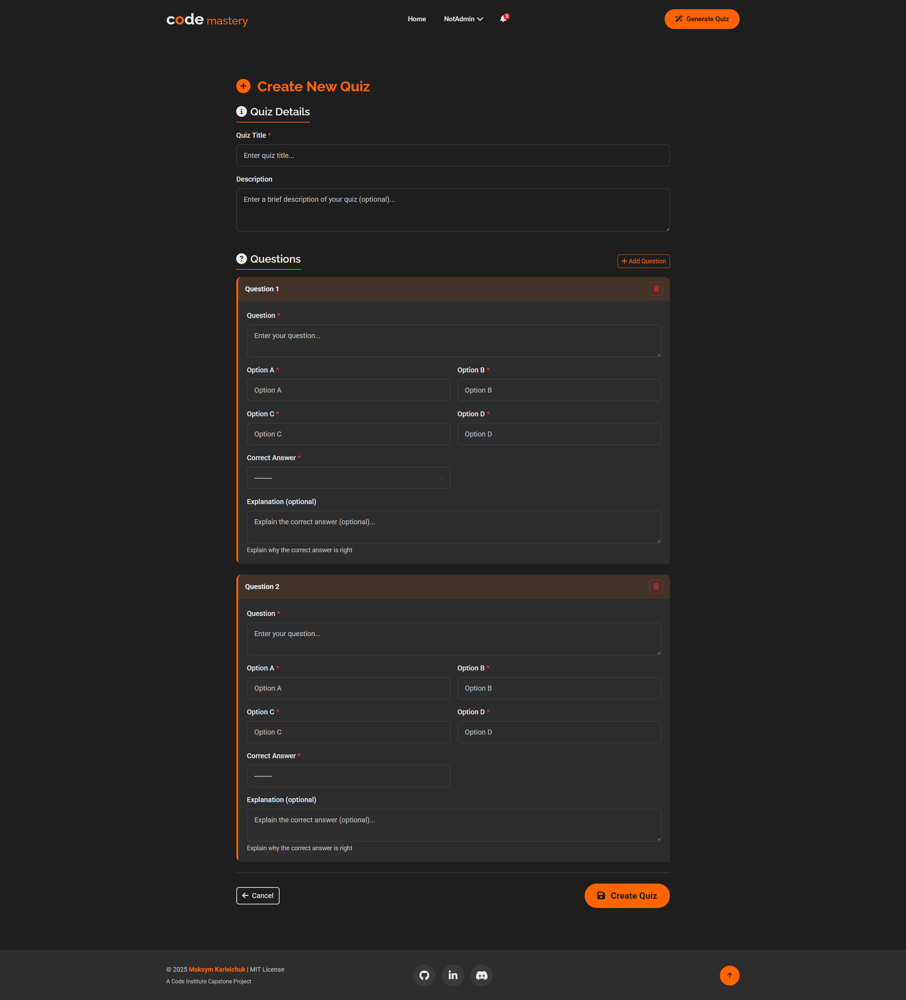

</details>

#### 📝 Taking Quizzes

**Quiz Detail Page**
- Clean display of all questions with radio button options
- Question progress indicator
- Validation ensures all questions are answered
- Unanswered questions highlighted with animation

**Quiz Results**
- Instant score calculation and display
- Visual progress bar showing percentage
- Each question shown with:
  - User's answer highlighted
  - Correct answer indicated
  - Explanation revealed
- Options to retake, share, or return home

<details>
<summary>View Quiz Page Screenshots</summary>

**Quiz Page**

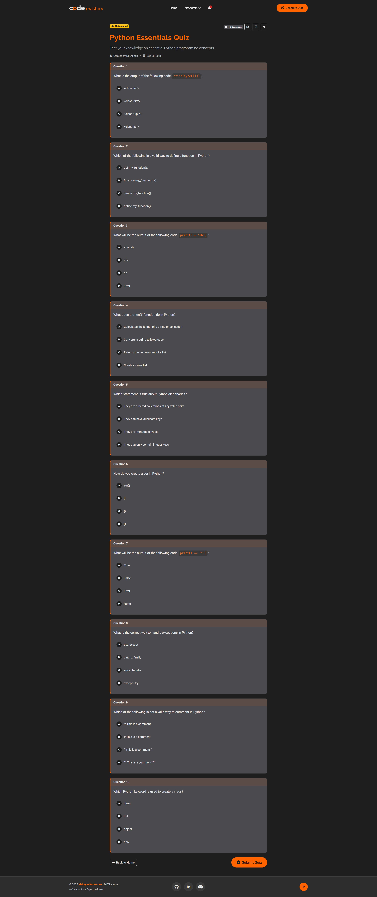

**Results Page**

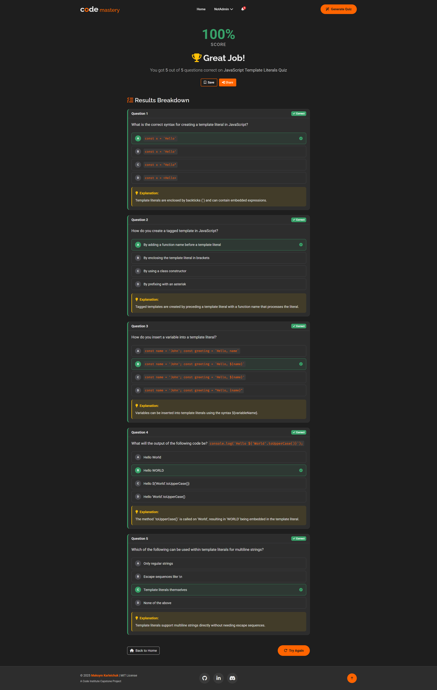

</details>

#### 👤 User Profiles

**Profile Page**
- Avatar display (male/female icons or custom upload)
- Bio section
- Statistics: quizzes created, quizzes saved, attempts, average score
- Created quizzes list with "View All" option
- Saved quizzes list with "View All" option (own profile only)

**Edit Profile**
- Avatar selection (male/female icons)
- Custom avatar upload via Cloudinary
- Bio editing with character limit

**Public Profiles**
- View other users' profiles and created quizzes
- Saved quizzes hidden for privacy

<details>
<summary>View Profile Page Screenshot</summary>

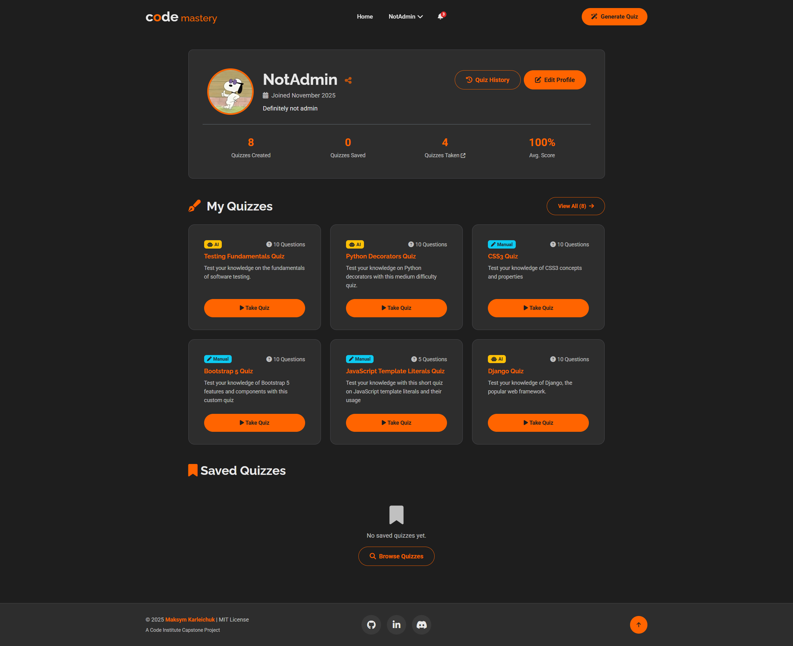

</details>

#### 💾 Save & Share Quizzes

**Save Functionality**
- Bookmark button on quiz detail and results pages
- Toggle save/unsave with visual feedback
- AJAX-powered for seamless experience
- Saved quizzes accessible from profile

**Share Functionality**
- Share button copies quiz URL to clipboard
- Toast notification confirms copy action
- Each quiz has unique SEO-friendly slug URL

#### 📊 Quiz History & Analytics

**Quiz History Page**
- List of all quiz attempts
- Shows quiz title, score, percentage, and date
- Click to view detailed attempt

**Attempt Detail**
- Full review of past attempt
- See which questions were correct/incorrect
- Review explanations for learning

<details>
<summary>View Quiz History Page Screenshot</summary>

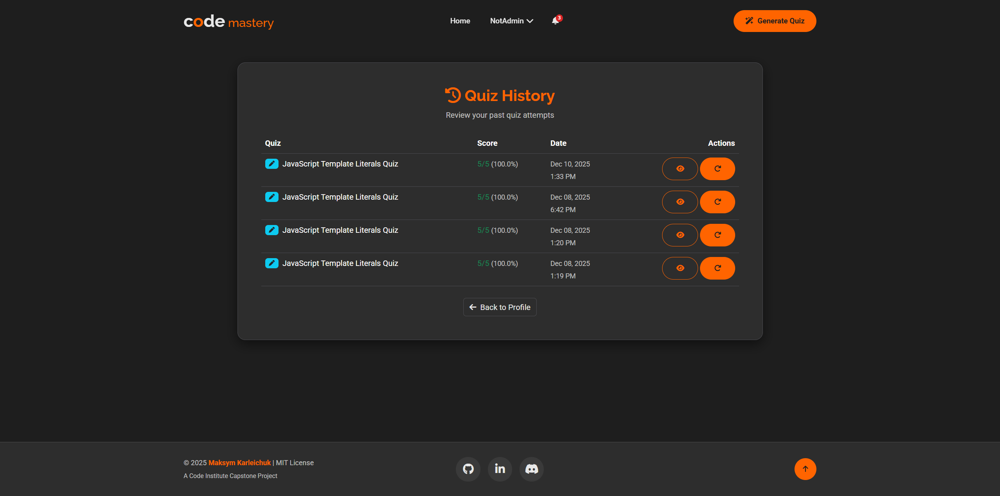

</details>

#### 🔔 Notifications

**Notification Types**
- Quiz completed: When someone completes your quiz
- Quiz saved: When someone saves your quiz

**Notification Features**
- Unread count in navigation bell
- Mark individual or all as read
- Click notification to view related quiz
- Real-time badge updates

<details>
<summary>View Notifications Page Screenshot</summary>

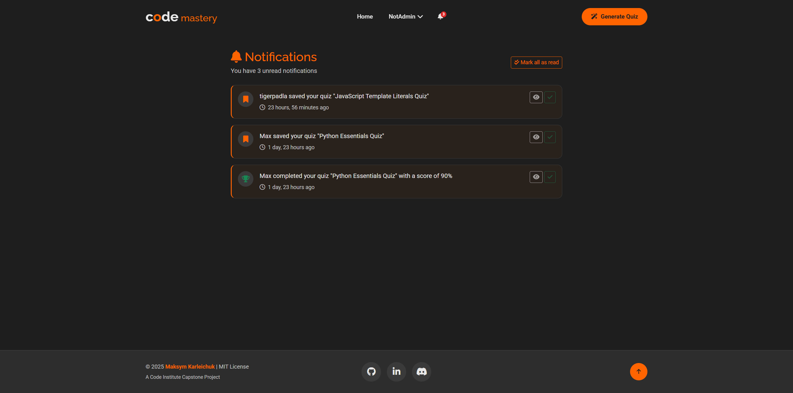

</details>

#### 🔐 Authentication

**Django Allauth Integration**
- Email/password registration and login
- Google OAuth social login
- GitHub OAuth social login
- Password reset via email
- Remember me functionality

**Session Management**
- Secure session handling
- Guest quiz count tracking
- Redirect to intended page after login

<details>
<summary>View Signup Page Screenshot</summary>

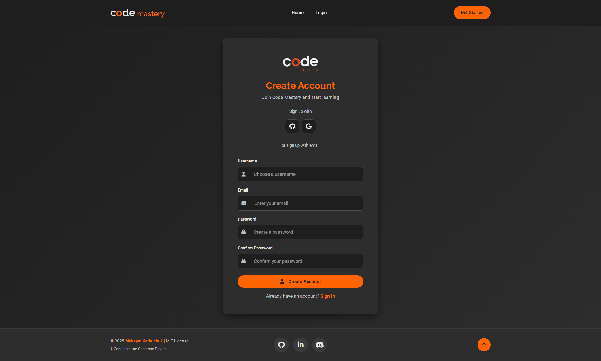

</details>

#### ♿ Accessibility Features

- Semantic HTML structure (`<header>`, `<main>`, `<nav>`, `<footer>`)
- ARIA labels on icon-only buttons
- `aria-hidden` on decorative icons
- `aria-expanded` on mobile menu toggle
- Visible focus indicators for keyboard navigation
- Proper form labels and associations
- Color contrast meeting WCAG guidelines

#### 📱 Responsive Design

- Mobile-first approach
- Breakpoints: mobile (<768px), tablet (768-1199px), desktop (1200px+)
- Touch-friendly tap targets
- Optimized images and assets

<details>
<summary>View Mobile Responsive Page Screenshot</summary>

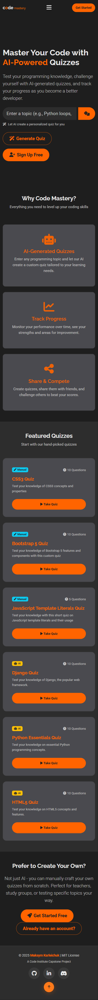

</details>

#### 🚫 Custom Error Pages

- **404 Page** - Branded error page matching site design with navigation back to home

### Future Features

| Feature | Description |
|---------|-------------|
| **Leaderboards** | Global and quiz-specific rankings |
| **Categories** | Organize quizzes by programming language/topic |
| **Difficulty Levels** | Easy, Medium, Hard quiz options |
| **Timed Quizzes** | Optional countdown timer for challenges |
| **Quiz Statistics** | Detailed analytics for quiz creators |
| **Comments** | Discussion on quiz pages |
| **Following** | Follow other users and see their quizzes |
| **Achievements** | Badges for milestones (10 quizzes, 100% scores, etc.) |

---

## Technologies Used

### Languages

- **Python 3.12** - Backend logic and Django framework
- **JavaScript (ES11)** - Frontend interactivity
- **HTML5** - Page structure
- **CSS3** - Styling and animations

### Frameworks & Libraries

| Technology | Purpose |
|------------|---------|
| Django 5.2 | Python web framework |
| Bootstrap 5.3 | CSS framework for responsive design |
| django-allauth | Authentication and social login |
| django-crispy-forms | Form rendering with Bootstrap |
| Cloudinary | Image hosting and transformation |
| WhiteNoise | Static file serving |
| psycopg2 | PostgreSQL database adapter |
| gunicorn | Production WSGI server |

### Tools & Services

| Tool | Purpose |
|------|---------|
| GitHub | Version control and repository hosting |
| Heroku | Cloud platform for deployment |
| Neon | PostgreSQL database hosting |
| GitHub Models (GPT-4o-mini) | AI quiz generation API |
| Cloudinary | Media storage and CDN |
| Font Awesome | Icon library |
| Google Fonts | Web typography |
| Visily | Wireframe design |
| DBDiagram | ERD visualization |
| Affinity Designer | Graphics and image editing |
| VS Code | Code editor |
| GitHub Copilot | AI coding assistant |

---

## Testing

### Automated Testing

The project includes a comprehensive test suite with **63 tests** covering models, views, and templates.

```bash
python manage.py test --verbosity=2
```

#### Test Coverage

| App | Test Class | Tests |
|-----|-----------|-------|
| accounts | ProfileModelTest | 8 tests |
| accounts | ProfileViewTest | 5 tests |
| accounts | ProfileEditViewTest | 4 tests |
| accounts | QuizHistoryViewTest | 2 tests |
| accounts | MyQuizzesViewTest | 2 tests |
| accounts | SavedQuizzesViewTest | 2 tests |
| accounts | SaveQuizViewTest | 4 tests |
| accounts | NotificationsViewTest | 3 tests |
| quizzes | QuizModelTest | 6 tests |
| quizzes | QuestionModelTest | 3 tests |
| quizzes | QuizAttemptModelTest | 5 tests |
| quizzes | NotificationModelTest | 3 tests |
| quizzes | HomeViewTest | 3 tests |
| quizzes | QuizDetailViewTest | 4 tests |
| quizzes | QuizCreateViewTest | 2 tests |
| quizzes | QuizSubmitViewTest | 5 tests |
| quizzes | TemplateTagsTest | 2 tests |

### Manual Testing

Manual testing was performed across all features and user flows:

| Feature | Test | Result |
|---------|------|--------|
| AI Quiz Generation | Enter topic and generate quiz | ✅ Pass |
| Random Topic | Click dice button, topic appears | ✅ Pass |
| Guest Limit | Generate 2nd quiz shows signup modal | ✅ Pass |
| Create Quiz | Fill form, add questions, submit | ✅ Pass |
| Edit Quiz | Modify quiz details and questions | ✅ Pass |
| Delete Quiz | Confirm deletion, quiz removed | ✅ Pass |
| Take Quiz | Answer all questions, submit | ✅ Pass |
| Quiz Results | Score displayed, answers reviewed | ✅ Pass |
| Save Quiz | Click bookmark, added to profile | ✅ Pass |
| Share Quiz | Click share, URL copied | ✅ Pass |
| User Registration | Sign up with email | ✅ Pass |
| Social Login | Google/GitHub OAuth | ✅ Pass |
| Profile Edit | Update avatar and bio | ✅ Pass |
| Notifications | Receive and mark as read | ✅ Pass |
| Mobile Navigation | Hamburger menu opens/closes | ✅ Pass |
| Responsive Design | Test on various screen sizes | ✅ Pass |

### Validation

#### HTML Validation (W3C)

All pages pass W3C HTML validation with no errors.

<details>
<summary>View HTML Validation Results</summary>

| Page | Result |
|------|--------|
| Home | 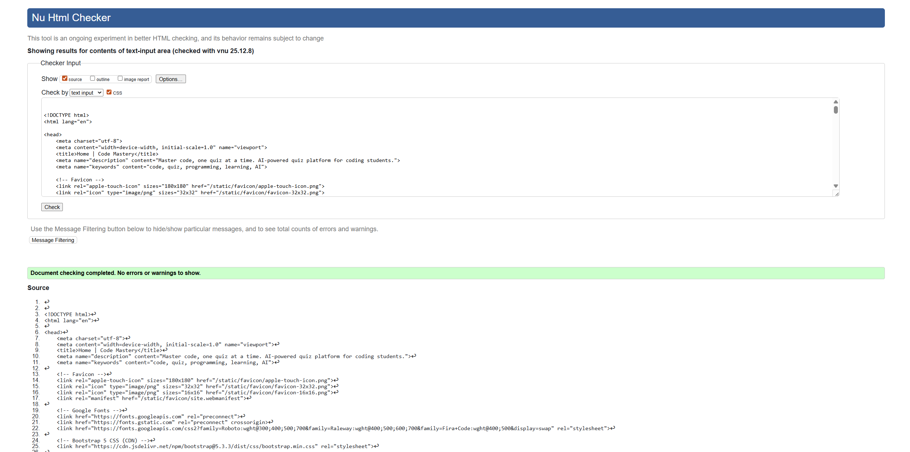 |
| Login | 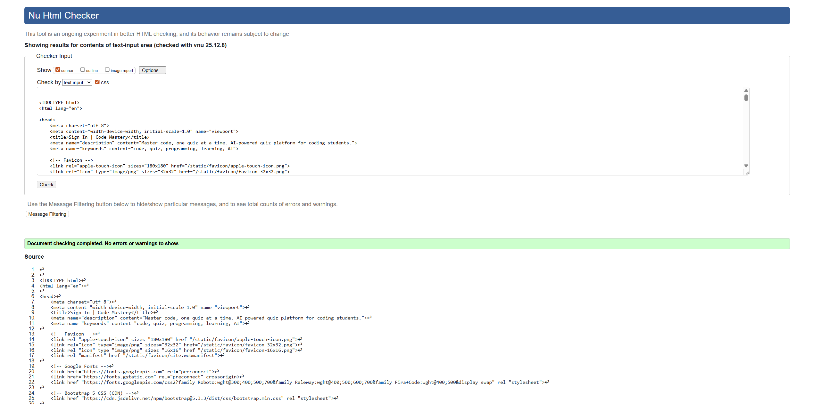 |
| Signup |  |
| Profile | 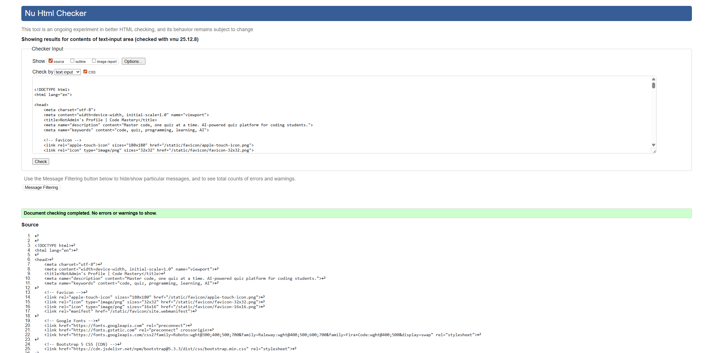 |
| Quiz Detail | 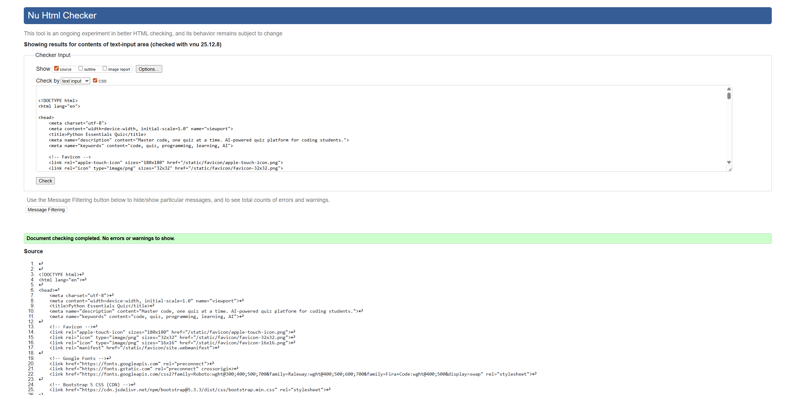 |
| Quiz Create |  |

</details>

#### CSS Validation (W3C Jigsaw)

All CSS files pass W3C CSS validation.

<details>
<summary>View CSS Validation Results</summary>

| File | Result |
|------|--------|
| style.css |  |
| home.css | 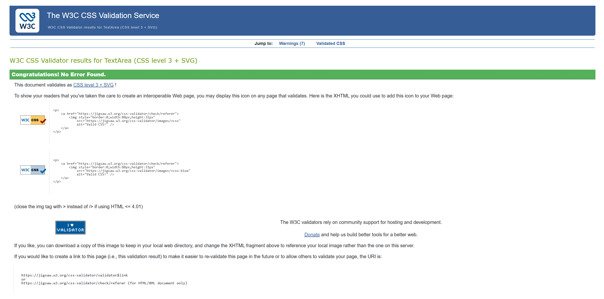 |
| auth.css |  |
| profile.css | 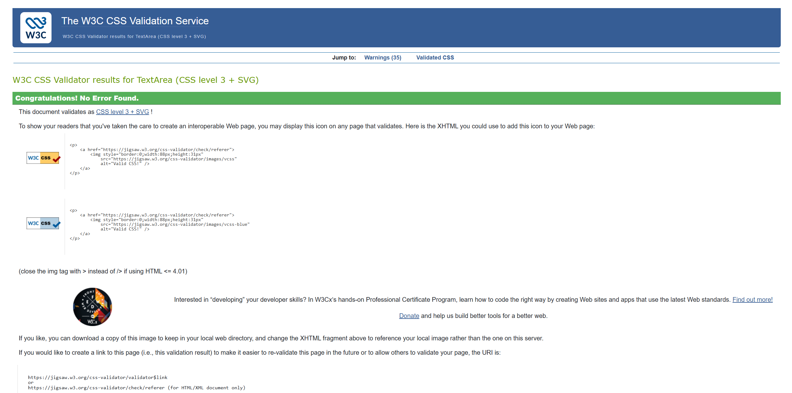 |
| quiz-detail.css | 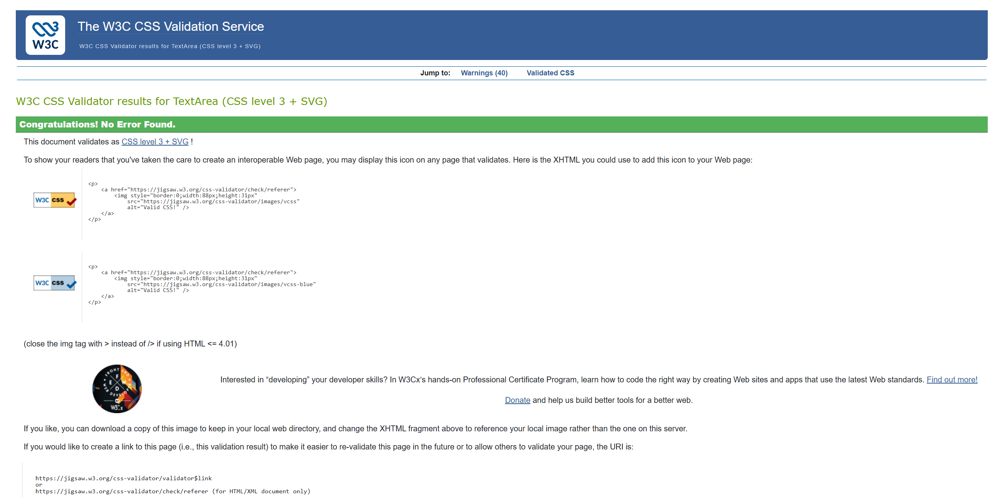 |
| quiz-create.css | 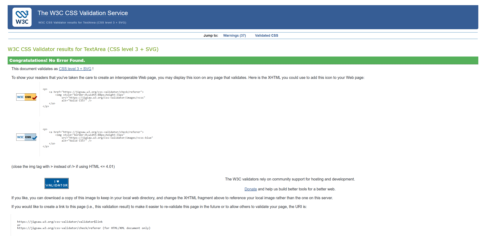 |
| quiz-results.css |  |

</details>

#### JavaScript Validation (JSHint)

All JavaScript files pass JSHint validation with ES11 configuration.

<details>
<summary>View JavaScript Validation Results</summary>

| File | Result |
|------|--------|
| main.js | 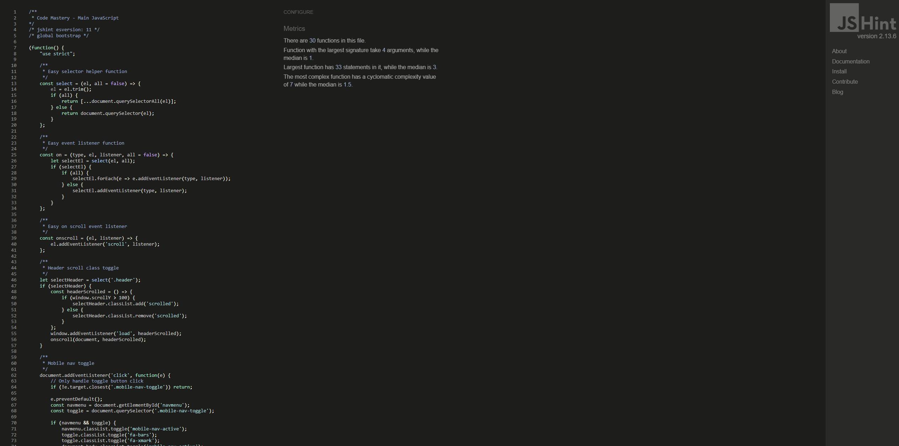 |
| home.js | 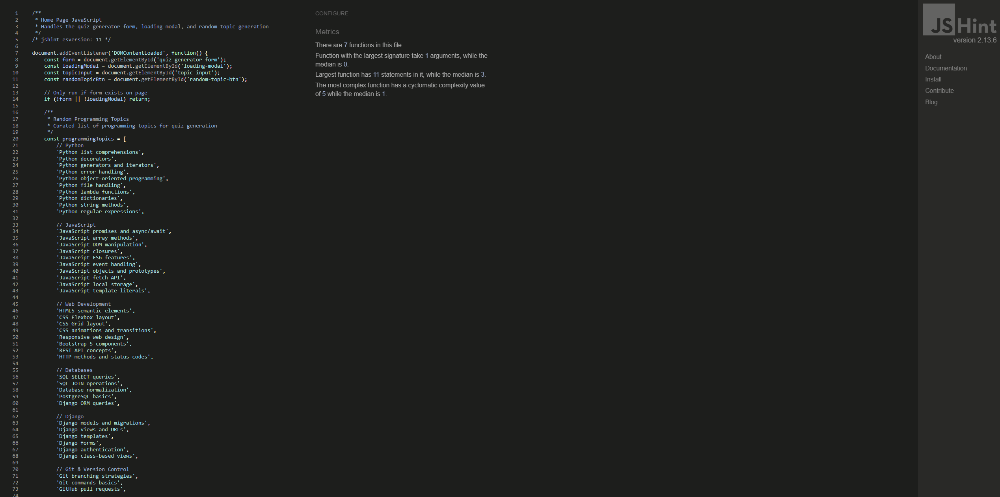 |
| quiz-detail.js | 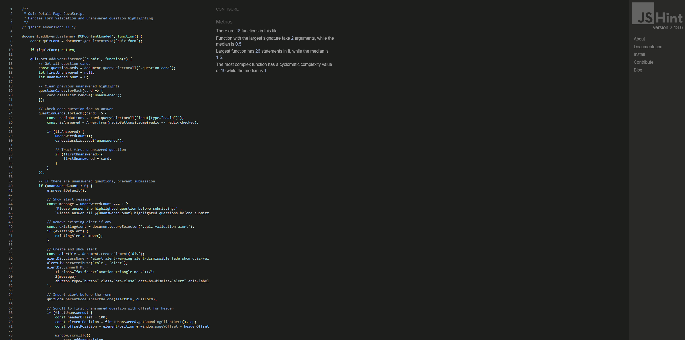 |
| quiz-create.js | 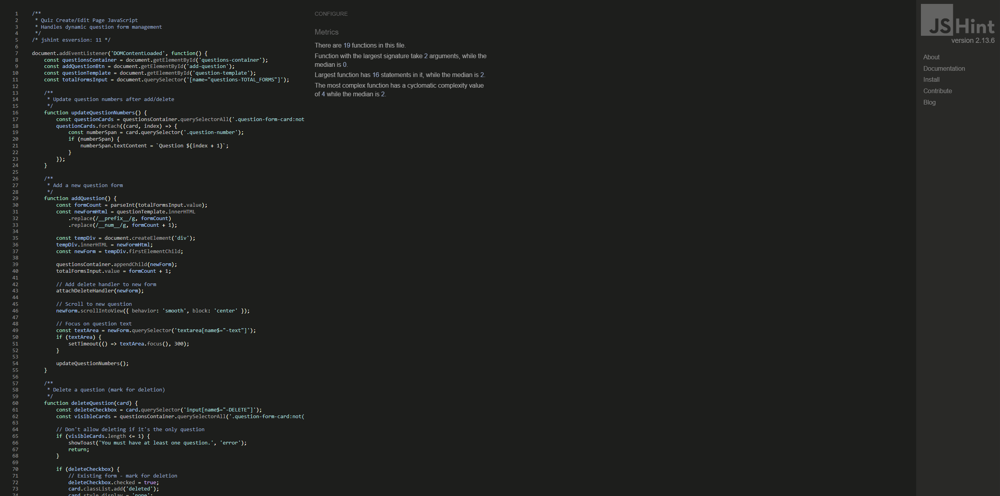 |
| quiz-results.js | 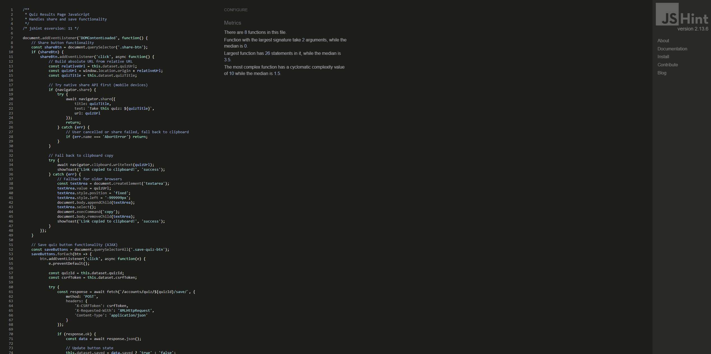 |

</details>

#### Python Validation (PEP8)

All Python files pass PEP8 validation using flake8 with max line length of 119.

```bash
flake8 accounts quizzes code_mastery --max-line-length=119 --exclude=migrations
```

Result: **All files pass with no errors.**

#### Lighthouse Validation

The live site was tested using Google Lighthouse for performance, accessibility, best practices, and SEO.

| Metric | Score |
|--------|-------|
| Performance | 96 🟢 |
| Accessibility | 94 🟢 |
| Best Practices | 100 🟢 |
| SEO | 100 🟢 |

<details>
<summary>View Lighthouse Results</summary>

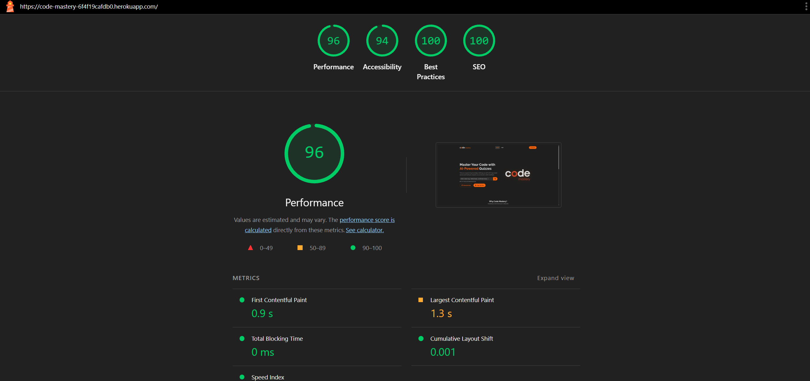

</details>

### Bugs

#### Solved Bugs

<a id="spaghetti-and-meatballs-quiz-vulnerability"></a>

| Bug | Solution |
|-----|----------|
| **"Spaghetti and Meatballs" Quiz Vulnerability** | Users could generate quizzes on any topic (e.g., recipes, random subjects) instead of programming-only content. Implemented a validation allowlist of 140+ programming keywords that checks user input, ensuring only legitimate coding-related quizzes can be generated. |
| **Code Snippets Breaking in Template Literals** | JavaScript quizzes with code snippets containing backticks would break the template literal syntax in the frontend, causing display errors. Fixed by escaping backticks in the AI response and using proper HTML entities for code display. |
| **Guest Quiz Count Not Persisting Across Pages** | The guest quiz generation limit (1 free quiz) was resetting when users navigated between pages, allowing unlimited free generations. The issue was caused by using JavaScript `localStorage` which wasn't being checked server-side. Fixed by implementing Django session-based tracking: the quiz count is now stored in `request.session['guest_quiz_count']`, ensuring the limit persists across all page navigations and browser refreshes until the session expires. |
| **Social Signup Page Unstyled** | When users signed up via Google or GitHub OAuth, they were redirected to a default django-allauth signup page that lacked the site's styling. Created a custom `socialaccount/signup.html` template with consistent dark theme styling. |

<details>
<summary>View "Spaghetti Incident" Screenshot</summary>

Before implementing the programming topics validation, users could generate quizzes on any topic:

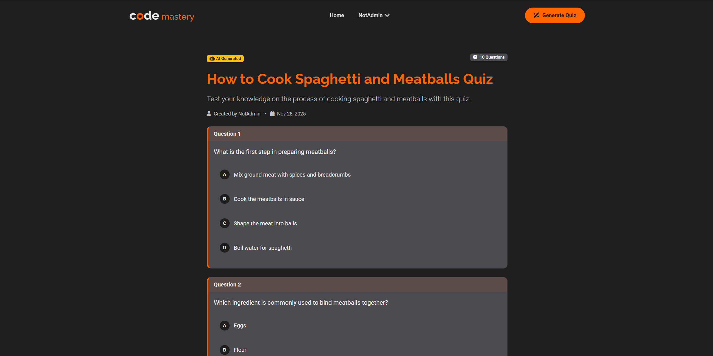

</details>

#### Known Bugs

No known bugs at time of submission.

---

## Deployment

### Heroku Deployment

The site is deployed on Heroku and is live at: **[https://code-mastery-6f4f19cafdb0.herokuapp.com/](https://code-mastery-6f4f19cafdb0.herokuapp.com/)**

To deploy your own version:

1. **Create Heroku App**
   ```bash
   heroku create your-app-name
   ```

2. **Set Environment Variables**
   ```bash
   heroku config:set SECRET_KEY=your-secret-key
   heroku config:set DATABASE_URL=your-neon-database-url
   heroku config:set CLOUDINARY_URL=your-cloudinary-url
   heroku config:set GITHUB_TOKEN=your-github-token
   heroku config:set DEBUG=False
   ```

3. **Add Buildpack**
   ```bash
   heroku buildpacks:set heroku/python
   ```

4. **Deploy**
   ```bash
   git push heroku main
   ```

5. **Run Migrations**
   ```bash
   heroku run python manage.py migrate
   ```

### Local Development

1. **Clone the Repository**
   ```bash
   git clone https://github.com/tigerpadla/code_mastery.git
   cd code_mastery
   ```

2. **Create Virtual Environment**
   ```bash
   python -m venv .venv
   source .venv/Scripts/activate  # Windows
   source .venv/bin/activate      # Mac/Linux
   ```

3. **Install Dependencies**
   ```bash
   pip install -r requirements.txt
   ```

4. **Create env.py**
   ```python
   import os
   
   os.environ['SECRET_KEY'] = 'your-secret-key'
   os.environ['DATABASE_URL'] = 'your-database-url'
   os.environ['CLOUDINARY_URL'] = 'your-cloudinary-url'
   os.environ['GITHUB_TOKEN'] = 'your-github-token'
   os.environ['DEBUG'] = 'True'
   ```

5. **Run Migrations**
   ```bash
   python manage.py migrate
   ```

6. **Create Superuser**
   ```bash
   python manage.py createsuperuser
   ```

7. **Run Development Server**
   ```bash
   python manage.py runserver
   ```

---

## What I Learned

This capstone project represents a significant milestone in my development journey. Before this, I had only built static HTML/CSS websites and interactive JavaScript games. Code Mastery is my **first full-stack application**, my **first Python project**, and my **first time using Django**. The learning curve was steep, but the growth was immense.

### The Jump from Frontend to Full-Stack

| Before Code Mastery | After Code Mastery |
|---------------------|-------------------|
| Static HTML/CSS sites | Full-stack Django application with database, authentication, and API integration |
| Simple JavaScript games | Complex state management across frontend and backend |
| Client-side only | Server-side logic, sessions, and security considerations |
| No database experience | PostgreSQL with ORM, migrations, and relationship modeling |
| No authentication | OAuth integration with Google/GitHub + custom user profiles |

### Technical Growth

| Area | Learning |
|------|----------|
| **Python & Django** | Learned Python from scratch, then applied it to build a complete web application. Understood Django's MVT architecture, URL routing, class-based vs function-based views, template inheritance, and the powerful ORM. |
| **Database Design** | First time designing a relational database schema. Learned about foreign keys, one-to-many relationships, migrations, and the importance of planning the data model before coding. |
| **AI/LLM Integration** | First time working with LLM APIs. Learned prompt engineering, JSON response parsing, and the critical importance of input validation to prevent misuse (the "spaghetti incident" taught me this the hard way). |
| **Authentication & Security** | Implemented OAuth flows with django-allauth, understood session management, CSRF protection, and why server-side validation matters more than client-side. |
| **Session vs Local Storage** | Discovered the difference between client-side (`localStorage`) and server-side (`Django sessions`) state management when implementing guest limits. A seemingly simple feature taught me about web security. |
| **Cloud Services** | First experience with Cloudinary for media management, Neon for PostgreSQL hosting, and Heroku for deployment. Learned about environment variables, production vs development settings, and the importance of separating configuration from code. |
| **Testing** | Wrote 63 automated tests covering models, views, forms, and services. Learned about test databases, fixtures, and mocking external APIs. |

### Soft Skills Developed

| Skill | How I Developed It |
|-------|-------------------|
| **Problem Decomposition** | The "spaghetti incident" seemed impossible at first—how do you prevent users from asking about anything? Breaking it down led to a practical solution: keyword validation + system prompts. |
| **User-Centric Thinking** | Every feature decision considered the user experience. Balancing API costs with user value led to the 1-free-quiz model that lets guests try before signing up. |
| **Debugging Complex Systems** | Full-stack bugs are harder to trace. Is it the frontend, backend, database, or API? I learned to use browser dev tools, Django debug toolbar, and systematic logging to isolate issues. |
| **Documentation** | Writing this README taught me that documentation is for future-me and for others. Explaining *why* decisions were made is as important as explaining *what* was built. |
| **Time Management** | Juggling bootcamp deadlines with feature development taught me to prioritize MVP features first, then enhance. The MoSCoW method in my user stories reflects this learning. |

### What I'd Do Differently Next Time

- **Start with tests (TDD)**: Would implement Test-Driven Development from day one rather than adding tests after features were built. Writing tests first helps clarify requirements.
- **Plan the database schema first**: Spent time refactoring relationships that could have been avoided with better upfront planning. ERD diagrams are worth the time investment.
- **API rate limiting**: Would add more sophisticated rate limiting beyond session-based counting—perhaps using Django's cache framework or a dedicated rate-limiting library.
- **Caching layer**: Would implement Redis caching for frequently accessed quizzes to reduce database queries and improve performance.
- **Feature flags**: Would implement feature flags from the start to enable gradual rollouts and easier A/B testing.

### The Bigger Picture

This project proved to myself that I can learn a completely new tech stack and build something real with it. Going from "I've never written Python before" to deploying a full-stack AI-powered application in just over a month is a confidence boost that will carry forward into every future project.

The bootcamp taught me the syntax. This project taught me how to *think* like a developer.

---

## Technical Decisions

Key architectural choices and the reasoning behind them:

| Decision | Why |
|----------|-----|
| **Django** | Capstone requirement for Code Institute. However, Django's ORM, admin panel, and django-allauth made it an excellent choice for rapid development with robust authentication. |
| **GitHub Models over OpenAI Direct** | GitHub Models Marketplace offered simpler authentication (just a token), excellent documentation, and GPT-4o-mini at competitive pricing. Being part of the GitHub ecosystem meant better integration with my existing workflow. |
| **PostgreSQL (Neon) over SQLite** | Production-ready from day one. Neon's serverless PostgreSQL offers generous free tier and seamless Heroku integration. |
| **Session-based Guest Tracking** | Client-side storage (`localStorage`) can be easily cleared or manipulated. Server-side sessions ensure reliable tracking of guest quiz limits, persisting across page navigations. |
| **140+ Keyword Allowlist** | Rather than trying to detect "bad" topics (very difficult), I validate against known programming terms. This positive validation approach is more secure and maintainable. |
| **Slug-based URLs** | SEO-friendly URLs (`/quiz/python-basics/`) instead of IDs (`/quiz/123/`) improve shareability and user experience. |
| **Cloudinary for Avatars** | Offloads image storage and transformation from Heroku's ephemeral filesystem. Automatic optimization and CDN delivery. |
| **WhiteNoise for Static Files** | Simpler than S3 for serving static files, with built-in compression and caching headers. |

---

## Credits

### Content

- Quiz generation powered by [GitHub Models](https://github.com/marketplace/models) (GPT-4o-mini)
- Programming topics curated from industry-standard curricula

### Media

- Default avatar icons from [Flaticon](https://www.flaticon.com/)
- Logo inspired by [Code Institute](https://codeinstitute.net/) branding, adapted for Code Mastery with the signature orange accent colour

### Code

- Authentication system built with [django-allauth](https://django-allauth.readthedocs.io/)
- CSS framework: [Bootstrap 5](https://getbootstrap.com/)
- Icons: [Font Awesome 6](https://fontawesome.com/)

### AI Tools in Development

AI tools played a significant role in accelerating development and improving code quality:

| Area | How AI Assisted |
|------|-----------------|
| **Deployment** | GitHub Copilot provided useful suggestions for fixing errors during Heroku deployment, including environment variable configuration and static file serving issues. |
| **Testing** | AI helped generate comprehensive test cases for models, views, and forms - covering edge cases I might have missed manually. |
| **Responsive Design** | Copilot helped identify layout inconsistencies across screen sizes, which were fixed before final deployment. |
| **Accessibility** | AI tools suggested ARIA labels, focus styles, and semantic HTML improvements to meet WCAG guidelines. |
| **Bootstrap Components** | AI helped generate Bootstrap components efficiently, with adjustments for accessibility and dark theme compatibility. |
| **Debugging** | When stuck on complex issues (like the session-based guest tracking), AI provided alternative approaches and helped trace the root cause. |
| **Documentation** | This README was developed with AI assistance, ensuring comprehensive coverage of all project aspects. |

> **Note**: While AI tools accelerated development, any code generated by AI code was reviewed, explained, tested, and adapted to fit the project's specific requirements. AI was a productivity multiplier, not a replacement for understanding.

---

## Acknowledgements

- **Code Institute** - For the Full Stack Developer curriculum and the opportunity to build this capstone project
- **GitHub Copilot** - AI pair programming assistant that helped accelerate development, debugging, and documentation
- **Dillon Mc Caffrey** - For guidance and feedback throughout the bootcamp and this project
- **Code Institute Staff and Students** - For support and problem-solving assistance

---

## License

This project is licensed under the [MIT License](LICENSE).

---

*Code Mastery - A Code Institute Capstone Project of Maksym Karleichuk*
